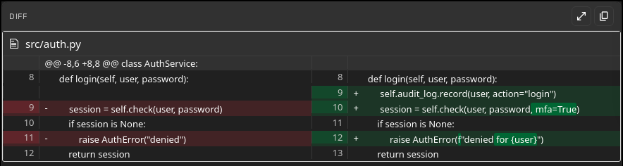
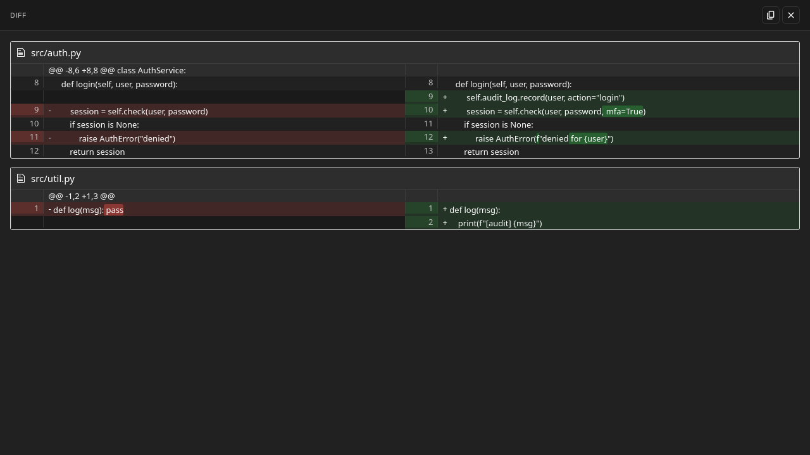
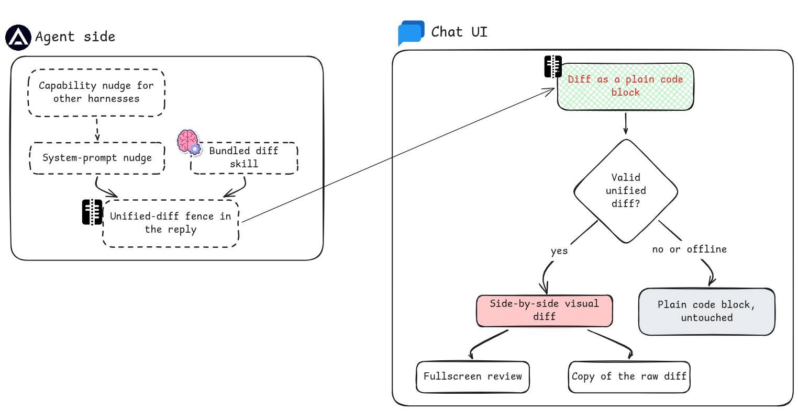

# DiffVisualizer — visual diffs in Agent Zero chat

<!-- BADGES:START (generated by the devkit — `make badges`) -->

[](https://github.com/agent-zero-plugins/agent-zero-plugin-diff-visualizer/actions/workflows/plugin-e2e.yml) [](https://github.com/agent-zero-plugins/agent-zero-plugin-diff-visualizer/tree/main/tests/e2e/features) [](https://github.com/agent-zero-plugins/agent-zero-plugin-diff-visualizer/tags) [](https://github.com/agent-zero-plugins/agent-zero-plugin-diff-visualizer/blob/main/LICENSE) [](https://github.com/agent-zero-plugins/agent-zero-plugin-diff-visualizer/blob/main/CONTRIBUTING.md)

<!-- BADGES:END -->

Renders unified-diff fenced code blocks as **side-by-side visual diffs** directly in the
Agent Zero chat UI — with a fullscreen maximize view, a copy-raw-source button, and
theme-aware styling. It also ships an agent **skill** that teaches the agent to emit
valid unified diffs, and a **system-prompt nudge** so the agent reaches for a diff
whenever it proposes edits, shows uncommitted changes, or compares before/after.

Reviewing a proposed change in prose is slow; reviewing it as a rendered diff is
instant. That's the whole plugin.

## 📸 What it looks like

Inline render in chat (side-by-side, per-file):

<p align="center">
  
</p>

Maximized fullscreen review (Esc / backdrop / ✕ to close):

<p align="center">
  
</p>

## ✨ Features

| Feature           | Detail                                                                                                   |
| ----------------- | -------------------------------------------------------------------------------------------------------- |
| Auto-render       | Any ` ```diff ` fence in chat becomes a visual diff (MutationObserver, debounced)                        |
| Side-by-side view | diff2html `side-by-side` output, line-matched                                                            |
| Multi-file fences | One fence containing several `diff --git` sections renders per-file                                      |
| Maximize          | Fullscreen overlay re-render at larger type; single-overlay invariant                                    |
| Copy raw source   | Copies the original diff text (never the rendered HTML)                                                  |
| Graceful fallback | CDN unreachable / malformed diff / empty block → the raw code block stays readable, nothing is swallowed |
| Theme-aware       | Consumes A0's `--color-*` custom properties with sane fallbacks                                          |
| Agent skill       | `skills/diff/SKILL.md` — unified-diff anatomy, capture recipes, pitfalls                                 |
| Behaviour nudge   | System-prompt extension steering the agent toward diff output                                            |

## ⚙️ Architecture

<p align="center">
  
</p>

## 💬 Usage

Every behaviour below is covered by a BDD scenario in [`tests/e2e/features/`](tests/e2e/features/),
and [`docs/BEHAVIOUR.md`](docs/BEHAVIOUR.md) shows each one as a screenshot captured from a passing
run — so what you read here is what CI proves on every push.

### Nothing to drive

There is no button to press and no mode to switch on. Whenever a message contains a fenced
` ```diff ` block, it is replaced in place with a side-by-side visual diff. Ask the agent for a diff,
paste one in yourself, or have a tool emit one — it renders either way.

Multi-file diffs render as one visual diff containing both files, so a patch that touches several
files reads as a single reviewable unit rather than fragments.

### Reviewing a large diff

Hover a rendered diff for its toolbar:

- **Maximize** opens a single fullscreen overlay for reading a long patch without the chat column
  squeezing it. Close it with the ✕, a backdrop click, or **Escape** — all three are asserted, and so
  is the fact that the inline diff survives the overlay closing.
- **Copy** puts the **raw diff text** on the clipboard, not the rendered HTML. You can paste it
  straight into `git apply`.

### When the input is not a clean diff

Two failure modes are handled deliberately, because silently mangling text is worse than not
rendering it:

- **Malformed diff text** falls back to the readable plain code block. You still see the content.
- **A non-diff code fence is left completely untouched.** A ` ```python ` block stays a Python block.
  The plugin only claims fences it can actually render.

Both are asserted scenarios rather than intentions.

---

## 📦 Install

**Plugin Hub (recommended):** open _Settings → Plugins_ in Agent Zero, find
**DiffVisualizer**, click _Install_.

**Manual zip:**

```bash
git clone https://github.com/agent-zero-plugins/agent-zero-plugin-diff-visualizer
cd agent-zero-plugin-diff-visualizer
make package                       # → dist/diff_visualizer.zip
# Then: A0 Settings → Plugins → Install from file → pick the zip
```

Enable the plugin after installing (it is store-gated, not always-enabled).

## 🔧 Configuration

None. The plugin has no configurable options, no secrets, and no environment
variables (`default_config.yaml` is intentionally empty; `meta.yaml` declares
`env: []`).

> **Air-gapped note:** the renderer lazy-loads `diff2html@3.4.51` from jsDelivr. If the
> CDN is unreachable (offline / strict CSP), diff blocks simply stay as readable plain
> code — no crash, no data loss.

## 🛠️ Development

Repo layout follows the org-canonical devkit standard: the repo root IS the plugin
(root layout — manifests, `extensions/`, `skills/`, `webui/` at top level), devkit
vendored at `tests/_testkit/` (public submodule).

```bash
git submodule update --init --recursive   # devkit + nested .agent-zero
make verify                               # Tier-1 static BDD gates (bdd-lint)
make package                              # build dist/diff_visualizer.zip
python -m pytest tests/ -v  # L1 component suite (10 tests)
make e2e                                  # full BDD e2e in the nested-A0 harness
```

The e2e harness boots a **nested Agent Zero** via rootless podman, installs the built
zip, runs a seam-off _red-proof_ (the suite must fail without the plugin), then runs the
BDD features in `tests/e2e/features/` (`playwright-bdd`). Specs assert **end state**
(rendered containers, overlay presence/absence), never transient markers.

Behaviour truth lives in `docs/spec/behaviour-spec.md` (BEH-1…9) — feature scenarios
trace to those IDs.

## 🧪 Tests

| Layer        | Where                                                                                 | What                                                                                              |
| ------------ | ------------------------------------------------------------------------------------- | ------------------------------------------------------------------------------------------------- |
| L1 component | `tests/test_diff_visualizer.py`, `tests/test_smoke.py`, `tests/test_publish_nudge.py` | surface validity, stray folders, dead hooks, manifest sanity, nudge publisher                     |
| L3 BDD e2e   | `tests/e2e/features/*.feature` + `tests/e2e/steps/`                                   | render, toolbar, maximize, 3 close paths, copy, multi-file, malformed fallback, non-diff negative |

## ⚖️ License

Apache-2.0 — see [LICENSE](LICENSE).
