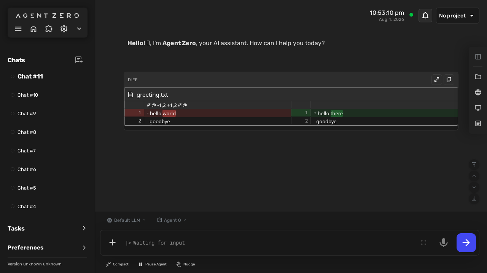
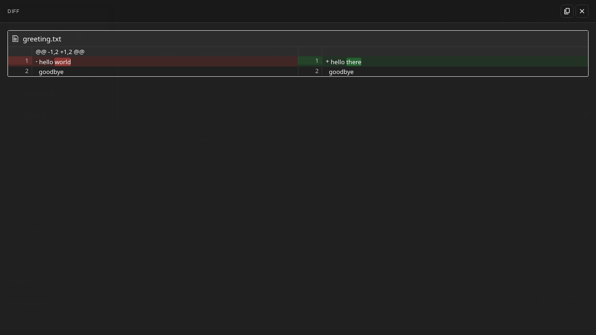
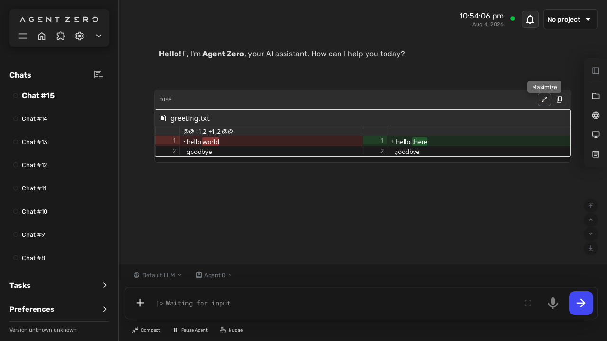
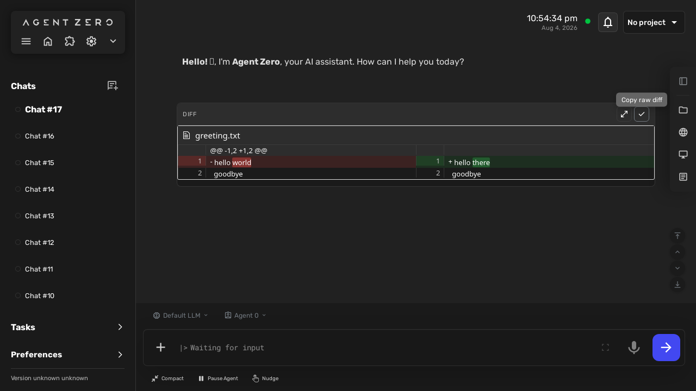
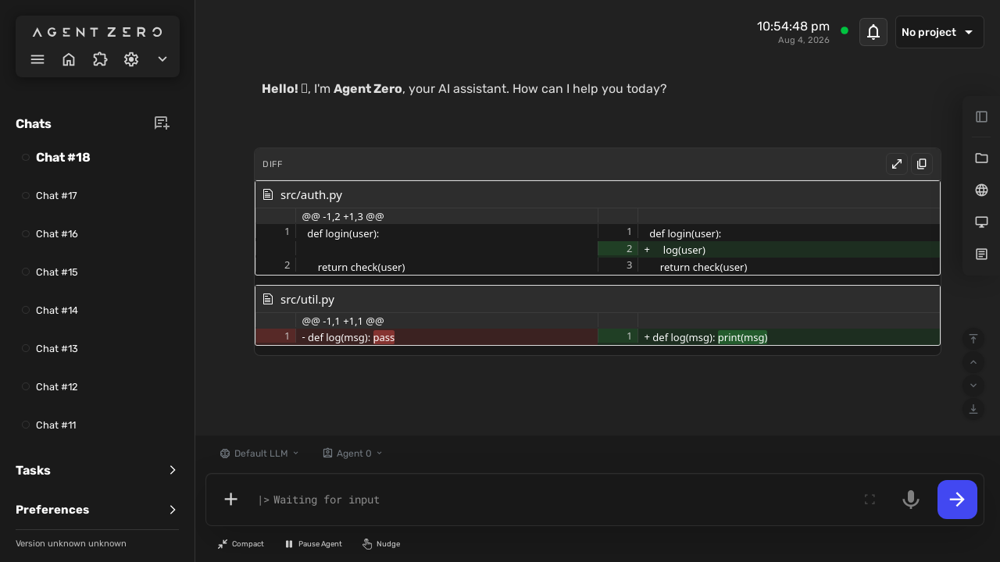
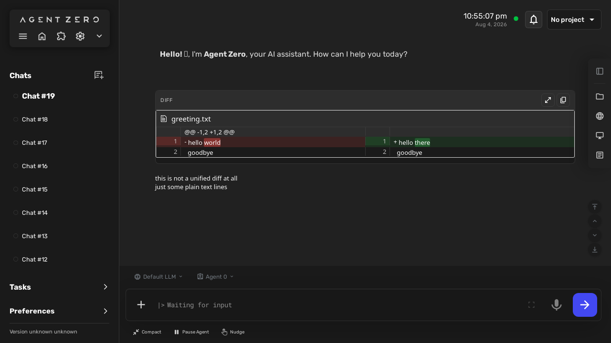
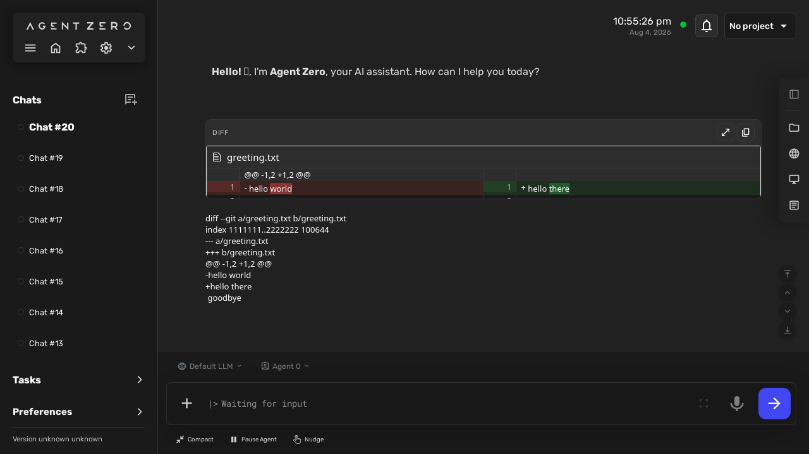

# DiffVisualizer — behaviour

<!-- GENERATED by the devkit (`make docs`) from this plugin's own e2e run.
     Do not edit by hand: every screenshot below is the asserted end state of a
     passing BDD scenario, so it cannot show behaviour the plugin no longer has.
     Captions are the scenario titles verbatim — reword them in tests/e2e/features/. -->

Each section is one scenario from `tests/e2e/features/`, with the screenshot the
test captured at its final assertion. 10 of 10 scenarios have one.

## Rendering diffs

### A diff block in the chat is rendered as a visual diff
BEH-1, BEH-3

### The rendered diff offers maximize and copy
BEH-2

## Diff overlay, copy, and edge-case handling

### Maximizing a rendered diff opens a single fullscreen overlay
BEH-4

### The overlay closes via its close button and the inline diff survives
BEH-5

### The overlay closes via a backdrop click
BEH-5

### The overlay closes via the Escape key
BEH-5

### Copying a rendered diff puts the raw diff text on the clipboard
BEH-6

### A multi-file diff renders both files inside one visual diff
BEH-1

### Malformed diff text falls back to the readable plain code block
BEH-3

### A non-diff code fence is left untouched
BEH-1

